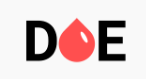
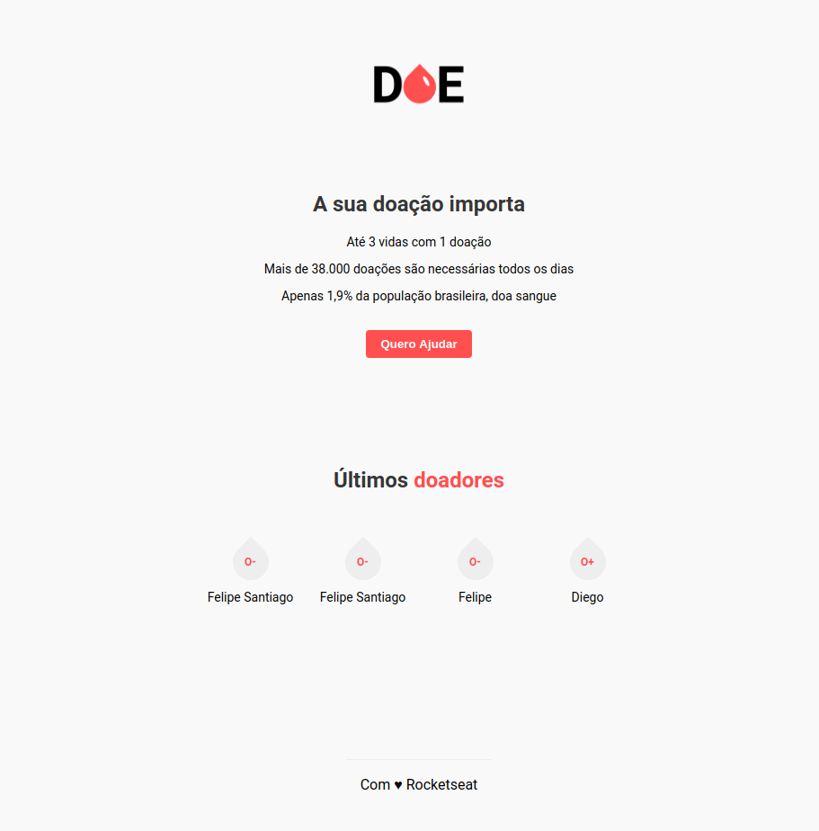

<h2 align="center">

  
   
  🚀 MaratonaDev 3 - Rocketseat
</h2>

  
  
  
  

<h1 align="center">
    
</h1>

## :book: Sobre o projeto

 Este foi um projeto desenvolvido nos dias 17 e 18 de Fevereiro de 2020 na MaratonaDev da Rocketseat, sendo em sua terceira edição. Ele ocorreu de forma gratuita e com
o objetivo de apresentar algumas das tecnologias e linguagens mais usadas para quem está ingressando agora na área de desenvolvimento. A ideia do projeto é: "Incentivar, encontrar e registrar doadores de sangue".

É um sistema muito simples para se cadastrar como doador de sangue.

## Tecnologias e ferramentas

 <ul>
  <li>Node.js</li>
  <li>Javascript</li>
  <li>Html</li>
  <li>CSS</li>
  <li>Nodemon</li>
  <li>PostgreSQL</li>
  <li>Nunjucks</li>
 </ul>
 
## Rodando o projeto:

1 - Clone o projeto e o abra utilizando seu editor preferido.

2 - Rode um `npm install` ou `yarn` na pasta do projeto.

3 - Crie uma nova conexão do PostgresSQL ou acesse usando o usuário padrão (postgres)

4 - Renomeie o arquivo `.env.example` para `.env`. Altere os valores das variáveis de ambiente conforme a sua necessidade

5 - Rode um `npm start` ou `yarn start` para executar o servidor.

## Preview

